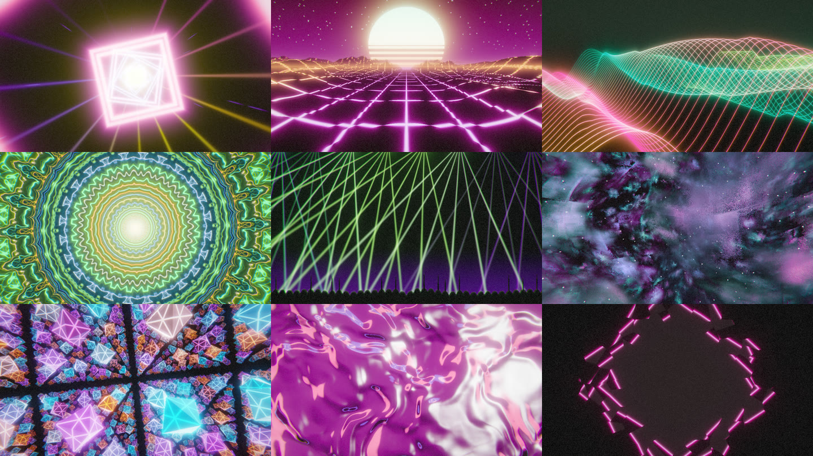

# Onset

Real-time visuals for DJs who play on rekordbox. Onset runs on the same laptop as rekordbox 7,
renders to a second display, and knows the structure of the track that is playing: beat grid,
phrases, hot cues. Animation is driven from a beat phase that does not lag, and a build-up can
start before the drop because rekordbox already analysed where the drop is.

It also shows what is playing (title, artists, album, year, key, BPM, artwork) and themes
the visuals from the artwork's colours.



## Quick start

On Windows 11 with rekordbox 7:

1. Get the Onset folder: unzip `Onset-<version>-windows.zip` anywhere, or build it yourself
   (see [Build and run](#build-and-run)) and run `scripts\package.ps1` to make that zip.
   Nothing else needs installing.
2. Start rekordbox in Performance mode and load a track.
3. Double-click `onset.exe`. In the launcher, pick the screen for the show and a style,
   then press **Start show**.
4. During the show: **H** stats, **C** now-playing card, **B** blackout, **Left/Right**
   scene, **F** fullscreen, **Esc** back to the launcher.
5. A rekordbox version Onset has not seen yet: open the **Setup** tab and press
   **Calibrate** (about two minutes, once per version).

With only one screen, the show covers it: press **F** for a window you can move aside, or
**Esc** to go back to the launcher, and Alt+Tab to reach rekordbox.

## Status

Pre-alpha. Onset follows a live rekordbox set: it reads the playing deck from rekordbox,
listens to the mix, and drives a show from both. Verified on a Surface Laptop Studio (RTX
3050 Ti) with rekordbox 7.2.18 and 7.2.19 and a DDJ-FLX10 on ASIO.

What it does:

- **Follows rekordbox.** It finds every deck in rekordbox's memory, knows which track each
  one has loaded, and follows the MASTER deck the moment MASTER moves: title, artwork, beat
  grid, phrases, hot cues, key, genre and mood come from the rekordbox library. Streamed
  tracks (TIDAL and the like) are recognised by comparing what plays with rekordbox's
  stored waveform, and instant doubles are followed.
- **Listens by frequency, not just loudness.** The mix splits into sub, bass, low-mid, mid,
  high-mid and treble, each with its own gain, plus kick, snare and hat detection. rekordbox's
  own 3-band waveform and vocal detection are read at the playhead too, so vocals light
  things up with no delay. Every scene moves different parts with different bands. The
  audio device can be changed live, and Onset follows a controller being unplugged and
  plugged back in.
- **Directs a show from the analysis.** Beats, bars, phrase changes, drops, breakdowns and
  hot cues become events: white flashes on drops, flashes in the cue's colour as the
  playhead passes a cue, the odd inversion or hue swing, camera shake and zoom on kicks.
  Strobe is off by default and never faster than 3 Hz. Each track gets its own random seed,
  so the same moments land differently in different tracks.
- **Picks scenes by itself.** Auto mode reads tempo, key, genre, rekordbox's mood and the
  cover's brightness. A dark, slow track gets Deep Space; a fast dance track gets Lasers or
  the Neon Tunnel. It can change scene per track, at drops, or every few phrases, with a
  glitch, zoom, flash or wipe between them. The HUD and the Now Playing card swell briefly
  on a new track or a drop.
- **Ten festival scenes**, raymarched in 3D or drawn in 2D, on an HDR pipeline with bloom,
  feedback trails and film grain: Neon Tunnel, Outrun, Silk, Mandala, Laser Show, Deep
  Space, Zero Gravity, Crystal, Liquid and Cover Art. Build-ups sweep light across the screen
  before a drop and every new phrase slides the picture; nothing flashes faster than three
  times a second. The four earlier scenes (`pulse`, `ring`, `warp`,
  `voronoi`) remain for low-end machines. Colours come from the cover art.
- **Synced lyrics.** Each track's lyrics are looked up on LRCLIB (with MusicBrainz for
  ISRC matching) the first time it plays, or for the whole library with one button, and
  cached. They follow the playhead line by line in a Clean, Glow or Karaoke style, and move
  with the drop.
- **A launcher for the set.** The Show tab has everything needed: output screen, a Chill,
  Club or Festival style, Auto scenes, and the card and stats switches. Advanced tabs hold
  the rest: scene pictures with per-scene speed and colour, effect strengths with live
  meters and preview buttons, where the card and stats sit and what they show, lyrics,
  graphics card and quality, the audio input, a blackout logo, and rekordbox calibration.

Frame times at 1920x1080, High quality, measured with `--bench` on the RTX 3050 Ti:

| Scene | Mean | p99 |
| --- | --- | --- |
| Neon Tunnel | 10.9 ms | 14.0 ms |
| Outrun | 4.3 ms | 6.0 ms |
| Silk | 7.8 ms | 12.6 ms |
| Mandala | 2.9 ms | 5.1 ms |
| Laser Show | 4.1 ms | 5.7 ms |
| Deep Space | 10.8 ms | 14.2 ms |
| Zero Gravity | 7.5 ms | (headless run) |
| Crystal | 11.1 ms | 12.7 ms |
| Liquid | 5.2 ms | 7.4 ms |
| Cover Art | 2.6 ms | 4.7 ms |

Zero Gravity was timed with the headless benchmark (`cargo test --release -p onset-render
--test gallery bench -- --ignored --nocapture`), which renders every scene without a window.
Adaptive resolution renders a little smaller when frames start missing the refresh.

Low and Medium quality render at a lower internal resolution and keep the heavy scenes out
of Auto, for integrated graphics.

Not done yet: reading rekordbox's sampler pads and FX state, and a streamed track's
identity straight from memory (today it is recognised by ear after a few seconds).

## Build and run

Build the release binary once (about five minutes the first time, a minute after that):

```bash
cargo build --release
```

The binary is `target\release\onset.exe` (`target/release/onset` in a Unix shell). It is a
single file; keep the `assets\` folder next to it or run it from the repository root, and it
also carries built-in copies of the shaders and fonts so it starts without them.

Start Onset. It opens the launcher, where you pick the screen and the style and press Start
show. With rekordbox running and calibrated it follows the playing deck; otherwise it waits:

```bash
target\release\onset.exe
```

`--scene tunnel` starts on one scene and turns Auto off.

For development without rekordbox, `--sim "<title>"` plays a track from your library through
the built-in simulator instead. That is a developer tool: Onset never plays music on its own
in normal use.

A debug build (`cargo build`, binary at `target\debug\onset.exe`) starts faster to compile but
renders several times slower; use it for shader work, not for a show.

`--monitor` takes a zero-based index or part of the monitor's name; without it the config
decides, and the primary monitor is the fallback. `--app-dir` points at a rekordbox data
folder other than `%APPDATA%\Pioneer\rekordbox`. `--seek 50` starts the simulator at 50 s,
`--gain 0.2` sets its output level.

Keys in the output window:

| Key | Action |
| --- | --- |
| Tab | Settings panel over the show |
| H, C | Toggle the HUD, toggle the Now Playing card |
| Left, Right | Previous or next scene |
| B | Blackout: black output until pressed again |
| F | Toggle fullscreen |
| Esc | Close the settings panel, or go back to the launcher |

With `--sim`, Space pauses the simulator, Home restarts the track, `[` and `]` change its
rate by 1 % and R reloads it.

Other flags: `--bench 20` runs for 20 s without vsync and prints frame statistics;
`--screenshot out.png` saves a frame a second before exit; `--settings` opens the panel at
start; `--config-path` prints where the config lives.

Developer CLI (`cargo run -p onset-cli -- <command>`):

- `library [--grep text]` lists the collection.
- `anlz <title>` prints a track's grid summary, phrases and cues.
- `sim <title> [--seek s] [--analyze]` plays a track and prints beat, bar, phrase, drop
  countdown, next cue and intensity live, with an optional band meter.
- `devices` and `listen [--device name]` list loopback-capable endpoints and meter one.

## Connecting to rekordbox

Onset reads rekordbox's live state (deck positions, and which deck is playing) from the
rekordbox process. Where those values live changes with every rekordbox release, so each
version needs a one-time calibration that writes `offsets\<version>.toml`. rekordbox 7.2.18
and 7.2.19 ship calibrated. For another version the launcher says the version is not
calibrated yet and Onset idles until you calibrate.

Calibrate with rekordbox open in Performance mode and the decks to yourself:

```bash
target\release\onset-cli.exe calibrate
```

It announces each step and watches rekordbox's memory until it sees you do it, so there is
nothing to type: play a track on any deck, pause it, play it again. The pause tells the
calibrator which counter is the real playhead (it stops and resumes) rather than a clock
that keeps running; it then records the pointers the player object carries around that
field. At runtime Onset scans for that description, so it finds every deck wherever
rekordbox allocated it, on every launch. The whole run takes about two minutes. The
launcher runs the same session from its Setup tab.

If tracks show one song behind, the saved description only matches one deck. Onset repairs
this at runtime and says so in the log; `onset-cli calibrate --refine` saves the repair.
Finding the decks takes up to 20 seconds after Onset or rekordbox starts, and the show keeps
running meanwhile.

Onset reads rekordbox's live state as follows, none of it written back:

- deck positions from rekordbox's process memory (read-only access);
- the loaded tracks from the audio files rekordbox keeps open while a track is loaded,
  matched to the library by path, so title, artwork, beat grid, phrases and cues come from
  the collection;
- the mix from the DJ controller's USB recording input when one is connected (a DDJ-FLX10
  on ASIO never plays through a Windows output), otherwise a WASAPI loopback of the output
  rekordbox plays to.

rekordbox does not expose which deck is MASTER in a way Onset can read yet, so the show
follows the deck that is playing; during a transition it stays on the outgoing deck until
that deck stops.

## Writing a scene

A scene is one WGSL file in `assets/shaders/` with a fragment entry point `fs_main` that
receives `VsOut { uv }` and returns HDR colour. `common.wgsl` gives it the music and the
show: `sub()`, `bass()`, `mid()`, `treble()` and `spectrum(t)` for the bands; `kick()`,
`snare()` and `hat()` for the drums; `music_time()`, `beat_count()` and the beat, bar and
phrase phases for time; `drop_hit()`, `tension()`, `energy()` and `darkness()` from the show
director; `palette(t)` and `artwork(uv)` for colour; plus noise, rotations and signed
distance functions for raymarching. Save the file while Onset runs and the scene recompiles
in place. Add it to `SCENES` in `crates/onset-render/src/scenes/mod.rs`, with a cost and a
line of description, to put it in the menu and in Auto mode.

## How it reads rekordbox

Onset does not talk to rekordbox through an API, because rekordbox has none. On the user's own
machine it reads:

- the rekordbox library database (`master.db`) and analysis files (beat grids, phrases, cues,
  waveforms) that rekordbox writes to the user's profile;
- rekordbox's process memory, to learn which deck is playing and where its playhead is
  (the pointer offsets are specific to each rekordbox version and are calibrated locally);
- the mix, from the DJ controller's USB recording input or a WASAPI loopback capture.

Nothing is written to rekordbox's files or memory.

## Requirements

- Windows 11 x64, rekordbox 7 (tested with 7.2.18 and 7.2.19), a controller in Performance mode.
- A second display for the output window and a GPU with Vulkan or DX12.
- To build: Rust (the pinned toolchain in `rust-toolchain.toml` installs itself through
  `rustup`), Visual Studio Build Tools with the C++ workload.

## Licence

Not decided yet. Until it is, all rights reserved by the author; dependency licences are
recorded in the repository. The bundled Inter typeface is under the SIL Open Font License 1.1
(`assets/fonts/LICENSE`).
