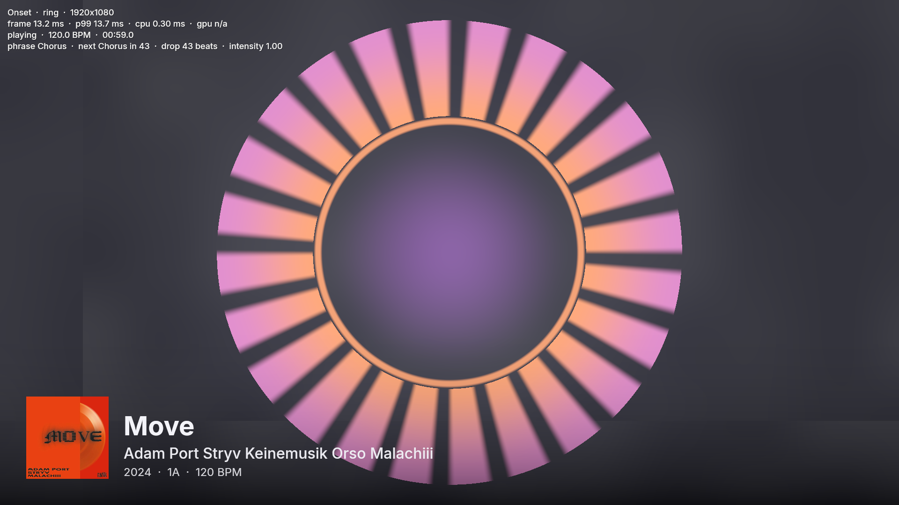
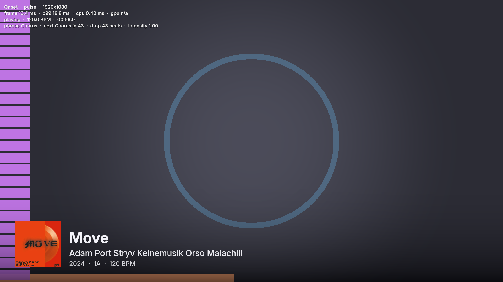
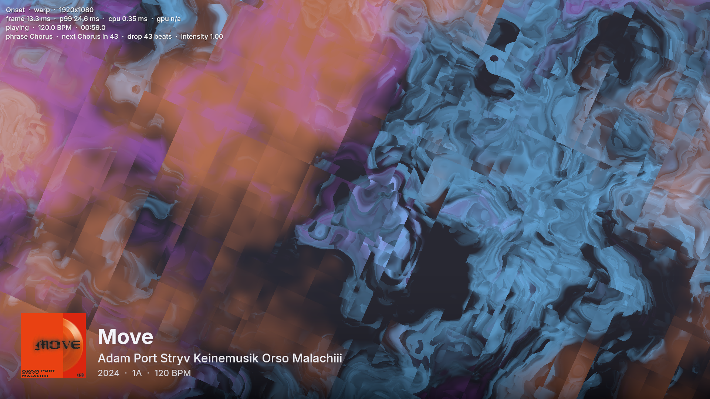
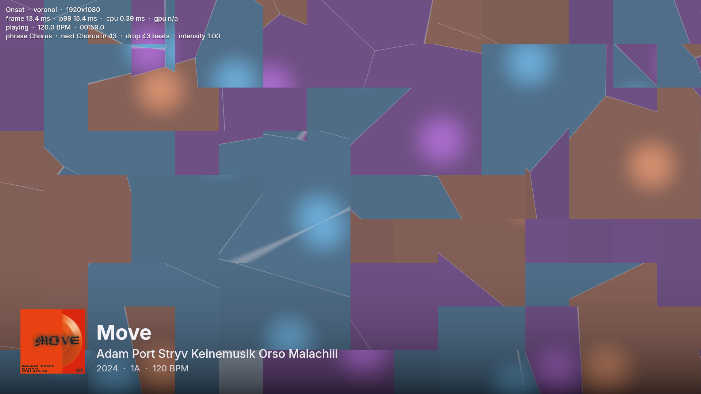
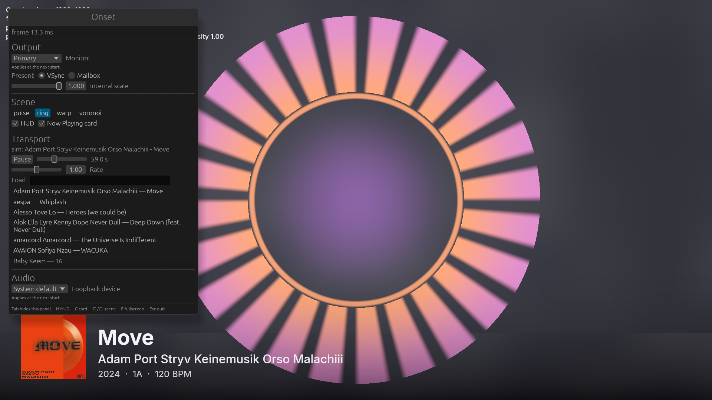

# Onset

Real-time visuals for DJs who play on rekordbox. Onset runs on the same laptop as rekordbox 7,
renders to a second display, and knows the structure of the track that is playing: beat grid,
phrases, hot cues. Animation is driven from a beat phase that does not lag, and a build-up can
start before the drop because rekordbox already analysed where the drop is.

It also shows what is playing (title, artists, album, year, key, BPM, artwork), themes the
visuals from the artwork's colours, and displays synced lyrics when they exist.



## Status

Pre-alpha, milestone 2 (v0.0.2). The renderer exists and runs at 1080p with headroom; the
live link to rekordbox is the next milestone, so today the music comes from the built-in
simulator playing a track from your rekordbox library.

What works, verified against a real rekordbox 7.2.18 library on an RTX 3050 Ti laptop:

- Reads `master.db` (SQLCipher, decrypted to a plaintext cache in about 150 ms, WAL included)
  and loads the collection: title, artists, album, year, key, BPM, duration, file, artwork,
  hot cues and memory cues.
- Parses the analysis files: beat grid, phrase structure (Intro, Up, Chorus, Down, Outro and
  the Low/Mid vocabularies) and cue lists.
- Models musical time: a jitter-filtered playhead clock, beat/bar/phrase phase, beats to the
  next phrase, a drop countdown to the next high-energy phrase, upcoming cues, and a director
  that turns all of that into an intensity envelope with anticipation.
- Plays a track through a built-in simulator with an exact playhead, and captures the live
  mix through WASAPI loopback into a 24-band analyzer with onset and silence detection.
- Renders on a chosen monitor, borderless and always on top, through wgpu (Vulkan or DX12).
  Four scenes read one uniform block (beat, bar and phrase phase, intensity, drop countdown,
  24 bands, five theme colours): `pulse`, `ring`, `warp`, `voronoi`. Shaders are plain WGSL
  files and reload while the app runs; a broken shader keeps the last good one and shows the
  compiler message in the HUD.
- A Now Playing card with the artwork, title, artists and a metadata line, crossfading over
  1.2 s when the track changes. Artwork decodes on a worker thread.
- A HUD with frame time, p99 over 120 frames, transport, phrase, drop countdown and the last
  shader error. A settings panel (Tab) that edits the config live.
- Performance, measured with `--bench` at 1920x1080 without vsync: every scene renders a
  frame in about 2.6 ms on average, 3.6 ms at the 99th percentile.

| pulse | warp | voronoi |
| --- | --- | --- |
|  |  |  |



## Run it

Build once, then start the output window with the simulator playing a title from your
rekordbox collection:

```bash
cargo build --release
```

```bash
./target/release/onset --monitor 1 --sim "Move" --scene ring
```

`--monitor` takes a zero-based index or part of the monitor's name; without it the config
decides, and the primary monitor is the fallback. `--app-dir` points at a rekordbox data
folder other than `%APPDATA%\Pioneer\rekordbox`. `--seek 50` starts the simulator at 50 s,
`--gain 0.2` sets its output level.

Keys in the output window:

| Key | Action |
| --- | --- |
| Tab | Settings panel: monitor, present mode, internal scale, scene, HUD and card, transport, audio device |
| H, C | Toggle the HUD, toggle the Now Playing card |
| Left, Right | Previous or next scene |
| Space, Home | Pause or resume the simulator, back to the start |
| [ , ] | Simulator rate down or up by 1 % |
| F | Toggle fullscreen |
| Esc | Quit |

Other flags: `--bench 20` runs for 20 s without vsync and prints frame statistics;
`--screenshot out.png` saves a frame a second before exit; `--settings` opens the panel at
start; `--config-path` prints where the config lives.

Developer CLI (`cargo run -p onset-cli -- <command>`):

- `library [--grep text]` lists the collection.
- `anlz <title>` prints a track's grid summary, phrases and cues.
- `sim <title> [--seek s] [--analyze]` plays a track and prints beat, bar, phrase, drop
  countdown, next cue and intensity live, with an optional band meter.
- `devices` and `listen [--device name]` list loopback-capable endpoints and meter one.

## Writing a scene

A scene is one WGSL file in `assets/shaders/` with a fragment entry point `fs_main` that
receives `VsOut { uv }` and reads the `frame` uniform declared in `common.wgsl` (beat phase,
bar phase, phrase phase, intensity, BPM, drop countdown, bands, theme colours, time,
resolution). `common.wgsl` also provides `band(i)`, `theme(i)`, `centred(uv)`, noise and
`beat_pulse`. Save the file while Onset runs and the scene recompiles in place. Add the file
stem to `BUILTIN_SCENE_NAMES` in `crates/onset-render/src/scenes/mod.rs` to put it in the
menu.

## How it reads rekordbox

Onset does not talk to rekordbox through an API, because rekordbox has none. On the user's own
machine it reads:

- the rekordbox library database (`master.db`) and analysis files (beat grids, phrases, cues,
  waveforms) that rekordbox writes to the user's profile;
- rekordbox's process memory, to learn which deck is master and where the playhead is
  (planned; the pointer offsets are specific to each rekordbox version and are calibrated
  locally);
- the master mix, via rekordbox's PC MASTER OUT setting and a WASAPI loopback capture.

Nothing is written to rekordbox's files or memory.

## Requirements

- Windows 11 x64, rekordbox 7 (tested with 7.2.18), a controller in Performance mode.
- A second display for the output window and a GPU with Vulkan or DX12.
- To build: Rust (the pinned toolchain in `rust-toolchain.toml` installs itself through
  `rustup`), Visual Studio Build Tools with the C++ workload.

## Licence

Not decided yet. Until it is, all rights reserved by the author; dependency licences are
recorded in the repository. The bundled Inter typeface is under the SIL Open Font License 1.1
(`assets/fonts/LICENSE`).
